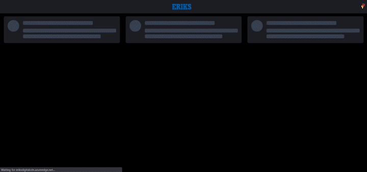
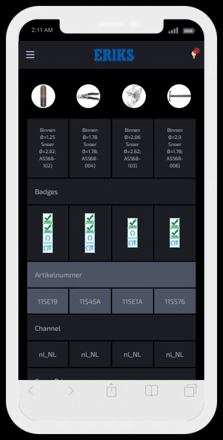
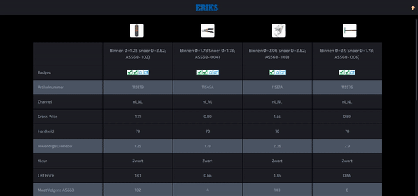
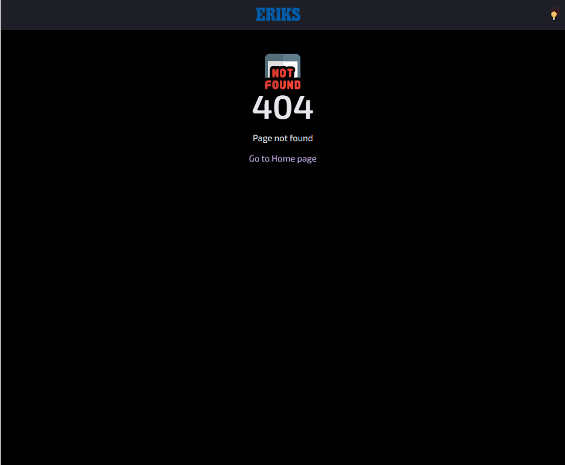
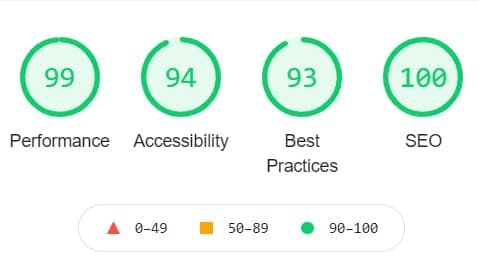

# Product Comparison Table App

> Designed and implemented a production ready product comparison table application. Select products to compare from the images at the top.

> Technology used: `React 17` , `Tailwind css` , `React-Query` , `Axios`

> Live application can be accessed from:

# 🚀 [Live-Demo](https://faran-eriks.web.app/)

---

## Table of Contents

- [Installation](#installation)
- [Features](#features)
- [Screencasts](#screencasts)
- [BrowserList](#browserlist)

---

## Installation

> To proceed with smooth installation you should have Node 14+ version installed in your system

> Please navigate inside the project folder and run below command to install `node_modules` in order to run this app locally.

```shell
$ npm install
```

> Once node dependencies are installed then please open `command prompt` and run `npm start` for a development server.

> Navigate to `http://localhost:3000/`.
> The app will automatically reload if you change any of the source files.

> Alternatively, Please have a look on [Live-Demo](https://faran-eriks.web.app/)

---

## Features

> Expected functionality:

- Product Comparison

> Additional functionality

- Light and Dark mode
- Responsive Layout

## Screencasts

> Home Page



---

> Responsive Layout



---

> Light and Dark Mode



---

> Not Found Page



---

> Performace



## BrowserList

> Best user experience can be enjoyed on:

- Google Chrome
- Mozilla Firefox
- Safari
- Microsoft Edge

---
